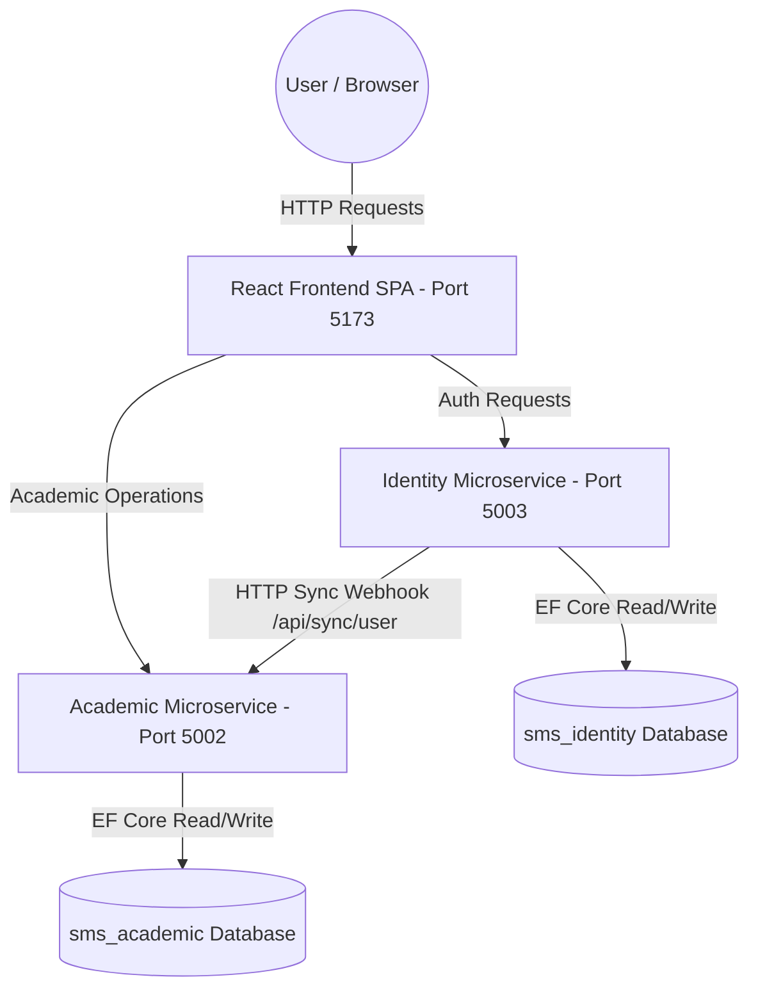
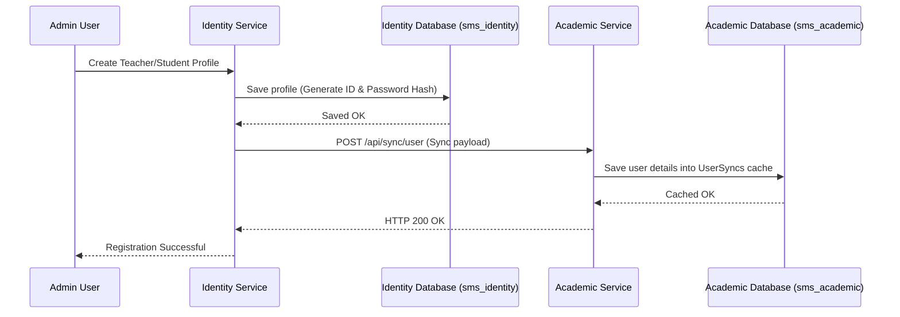

# High-Level Architecture

This document describes the high-level architecture, database model, and synchronization mechanisms of the **Student Management System**.

---

## System Architecture Diagram

The system is designed with a decentralized microservices architecture where services communicate via HTTP webhooks, maintaining database-level isolation.



---

## Component Details

### 1. React Frontend SPA (`frontend/`)
* **State Management**: Orchestrated via `AuthContext.jsx` which manages token lifetimes, token headers on all outgoing requests, user profiles, and logs.
* **Views**:
  * `Login.jsx`: Includes OTP request panels for recovery.
  * `AdminDashboard.jsx`: Standard Principal dashboard.
  * `LabAdminDashboard.jsx`: Class coordinators managing schedules, assignments, and grades/attendance overrides.
  * `TeacherDashboard.jsx`: Logging topics covered, manual check-in rosters, assignment CRUD, and locked grade entries.
  * `StudentDashboard.jsx`: Dynamic digital ID cards displaying enrollment QR codes (generated using `qrcode` library on mount) and history transcripts.
* **Scanner Simulator**: A floating simulator panel that executes entry and exit attendance scans by communicating directly with the Academic Service.

### 2. Identity Microservice (`backend/IdentityService`)
* **Purpose**: Identity and user catalog master service.
* **Key Components**:
  * `AuthController.cs`: Validates logins, issues JWT tokens, extracts emails, and generates recovery OTPs.
  * `AdminController.cs`: Handles teacher and student registrations and parses bulk student imports from CSV files.
  * `SyncService.cs`: Triggers an HTTP POST webhook payload (`id`, `role`, `name`, `employeeIdOrEnrollment`, `email`) on registration or updates to keep the Academic service synced.

### 3. Academic Microservice (`backend/AcademicService`)
* **Purpose**: Handles academic logistics, class schedules, rosters, assignment marks, and exams.
* **Key Components**:
  * `SyncController.cs`: Receives synchronization webhook payloads from the Identity Service to maintain the local cached table `UserSyncs`.
  * `SessionController.cs`: Coordinates sessions, reschedules times, and records topics covered.
  * `AttendanceController.cs`: Manages manual attendance checklists and QR code double-scans (checking check-in/out times in IST).
  * `AssignmentController.cs` & `ExamController.cs`: Manages assignments and grade submissions. Locks teacher updates once initial grades are entered.
  * `ReportController.cs`: Aggregates performance stats and compile semester metrics for Principal reports.

---

## Cross-Service Data Synchronization (Webhook Pattern)

To avoid synchronous database runtime joins across services, the **Identity Service** acts as the source of truth for user details. On every write or edit:

1. Admin creates a user in the **Identity Service**.
2. Identity Service registers the record in its PostgreSQL database (`sms_identity`).
3. Identity Service triggers an asynchronous HTTP POST task to Academic Service (`/api/sync/user`).
4. Academic Service saves this sync copy in its `UserSyncs` table inside PostgreSQL (`sms_academic`).
5. Academic Service queries `UserSyncs` locally when compiling rosters, grades sheets, and class scheduling details.



---

## C# Clean Architecture Pattern

Both microservices are built following a Clean Architecture code organization pattern:

```
[Controllers]  -->  [Repositories (Interfaces & Implementations)]  -->  [DbContext / EF Core]  -->  [PostgreSQL]
      ^
      |--- [Middlewares] (Exception handling, JWT parsing, IST helpers)
```
* **Repository Pattern**: Abstracted database queries to ensure clean unit testability.
* **Middlewares**:
  * `ExceptionHandlingMiddleware`: Formats database/runtime errors into clean JSON response envelopes.
  * `EmailExtractorMiddleware`: Automatically reads claims on validated Bearer tokens, injecting user emails and roles context directly into request containers.
